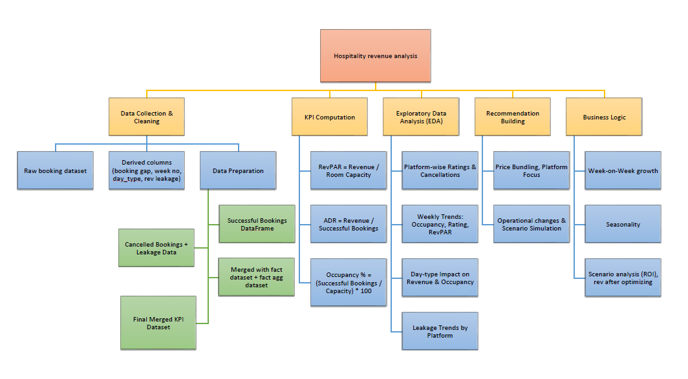

# 🏨 Optimizing Revenue Leakage & Profitability in the Hospitality Sector

### 👨‍💻 Author: Ritam Mondal  
🎓 B.Tech + M.Tech (Dual Degree), IIT Kharagpur '28  
📫 ritamm134@gmail.com  

   visit my  <a href="https://www.linkedin.com/in/ritam-mondal-86a369287/" target="_blank">
    </a>  

    
---

## 📘 Overview

This project focuses on identifying and minimizing **revenue leakage** while improving **occupancy efficiency** and **profitability** for a hotel chain. we analyze trends across bookings, revenue, room categories, and platforms to suggest impactful business strategies.
The work is divided into 4 phases:
- **Phase 1**: Full data preparation, cleaning, and analysis done using **Google Colab (Python)** [notebook](Optimizing_Revenue_Leakage_&_Profitability_in_the_Hospitality_Sector.ipynb)
- **Phase 2**: produced the [detailed report](Dashboard and Reports/Report of Hospitality data analysis.pdf) of this data analysis
- **Phase 3**: Final [dashboard (PDF Preview)](Dashboard%20and%20Reports/Only%20Dashboard%20imgs.pdf) creation and insights built in [**Power BI**](Dashboard%20and%20Reports/Hospitality%20analysis%20dashboard.pbix)
- **Phase 4**: Prepared the final ppt [presentation](Hospitality%20Analytics%20Project%20Presentation.pptx.pdf) of this project.
---

## ❓ Problem Statement
                                                               
Hotels often face challenges like:                                         
- High **cancellation-related revenue loss**                  
- Low **weekday occupancy**                                
- Underused **high-end room categories**                        
- Over-dependence on **third-party booking platforms**                    
                                                                              
This project aims to analyze these problems using real data and propose data-backed, actionable solutions for operational changes or consulting recommendation.                                 
                                                                                                                                                                     
---
                               
## 🎯 Project Objectives

-  Identify key causes of **revenue leakage**
-  Analyze trends across **bookings, cancellations, ratings, and revenue**
-  Propose **policy and operational improvements**
-  Build a KPI-driven dashboard using:
  - ADR (Average Daily Rate)  
  - RevPAR (Revenue per Available Room)  
  - Occupancy %  
  - Realisation %  
  - Revenue Leakage %

---

## 📁 Dataset Description 📎[Data set Link](Data%20sets)

| File                          | Description                                                |
|------------------------------|------------------------------------------------------------|
| `fact_bookings.csv`          | Individual booking details, guests, ratings, and platform  |
| `fact_aggregated_bookings.csv` | Daily room-level booking summaries (capacity, success, etc.) |
| `dim_hotels.csv`             | Property metadata — city, category, property name          |
| `dim_rooms.csv`              | Room class and room ID mapping                             |
| `dim_date.csv`               | Date dimension with day type (weekday/weekend), week no.   |

---
## Project framework

Here’s a simplified version of our project’s logical workflow, which is represented as hierarchical framework image:



## 💻 Workflow 

### 🔹 Phase 1: Python (Google Colab)
- Used `pandas`, `seaborn`, `matplotlib` for:
  - Data cleaning & transformation
  - Exploratory Data Analysis (EDA)
  - Boxplots, correlation heatmaps, cancellation behavior
  - Computed key KPIs: RevPAR, ADR, Realisation %, Week-on-Week change % (WoW)
  - Identified late vs early booking patterns and **simulated leakage optimization**

### 🔹 Phase 2: Report preparation
- Summarized all key findings and charts from Colab
- Documented insights room-wise, platform-wise, and week-wise
- Explained revenue leakage causes and scenario simulation
- Structured report with visuals, insights, and business logic

### 🔹 Phase 3: Power BI
- Imported preprocessed datasets into Power BI
- Designed data model linking `fact_bookings`, `fact_aggregated_bookings`, `dim_date`, `dim_rooms`, `dim_hotels`
- Built advanced DAX measures:
 - Occupancy %, RevPAR, ADR, Realisation %, WoW % Change, Room-specific stats
- Created interactive visuals:
 - Slicers, cards, combo charts, time trends, donut/bar/funnel charts
- Dark-themed, KPI-focused layout with strong storytelling visuals

### 🔹 Phase 4: Final Presentation
- Slide-by-slide explanation of dashboard visuals and insights
- MECE-structured analysis (Revenue → Occupancy → Leakage → Solutions)
- Business recommendations with KPI impact
- **SWOT analysis** and strategic action plan included

---

## 📊 Key Insights            
                          
-  Applying **non-refundable policy** to late bookings (≤ 2-day gap) reduces **leakage by ~49%**
-  Weekdays generate more revenue, but **weekends are more efficient** (higher RevPAR & Occupancy)
-  Top 3 revenue properties: **Atliq Exotica, Palace, City**
-  **Presidential rooms** have highest ADR but lowest booking volume — underutilized segment
-  Direct platforms underperform heavily compared to 3rd-party apps
                                    
## 🧠final Recommendations made               
                                           
- Apply **late booking penalty** or non-refundable clause for gap ≤ 2 days
- Promote **weekday combo packages** (early check-in, meals)
- Improve **direct booking platform** experience with loyalty rewards
- Audit and re-strategize **low-revenue properties** (Seasons, Grands)
- Monitor Week 32-type dips and plan marketing or operational fixes in advance.
- Focus on Presidential & Premium rooms during weekends to improve revenue.

## 📷 Sample Visualizations


```markdown


